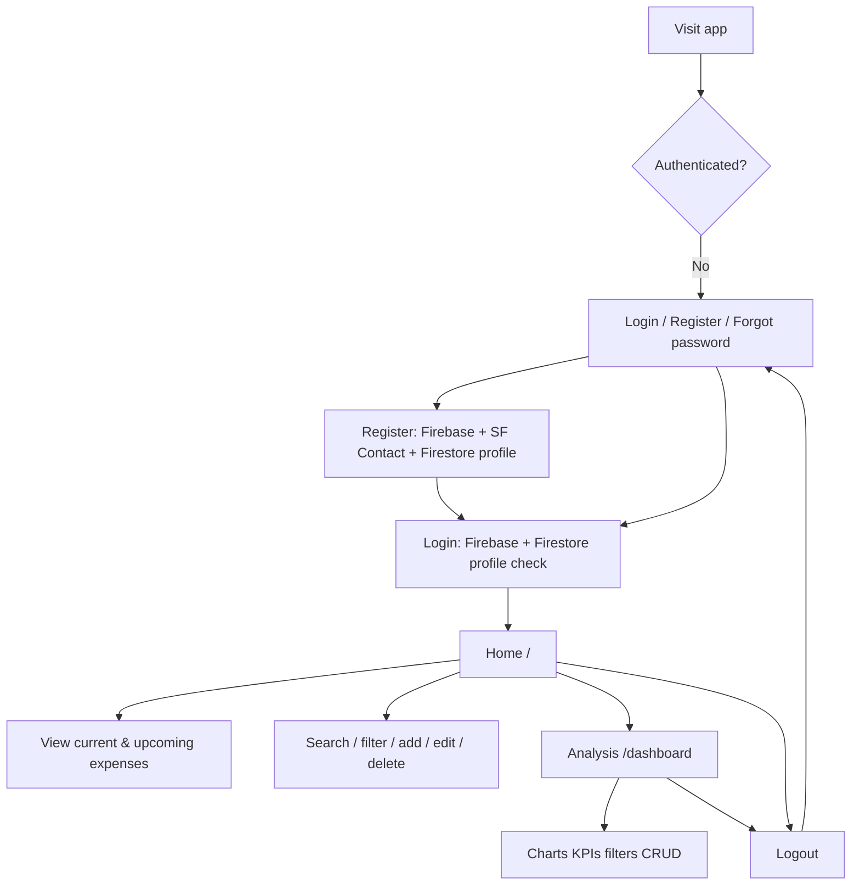
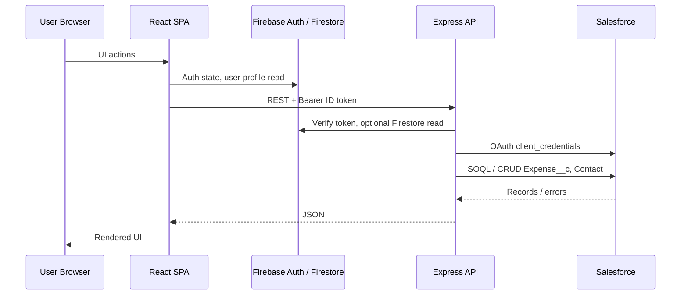

# Project Analysis — Expense Tracker

> Personal portfolio project. This document is derived from the repository source code, configuration files, and on-disk project structure only. No README files were used as sources.

---

## 1. Main Business Purpose

The application is a **personal expense tracker** that lets authenticated users:

- Record, edit, and delete expense transactions
- Categorize spending and mark items as recurring
- View current vs. upcoming expenses on a home dashboard
- Analyze spending trends, category breakdowns, and filtered transaction history

**System of record for expense data:** Salesforce custom object `Expense__c`.

**User identity bridge:** Firebase Authentication + Firestore user profile linked to a Salesforce `Contact` record.

The backend is described in `backend/package.json` as a *“Secure proxy between the expense tracker frontend and Salesforce.”* The React app does not call Salesforce directly; it calls the Node/Express API, which holds Salesforce credentials server-side.

---

## 2. Project Structure

```
expense/
├── backend/                 # Express API proxy
│   ├── app.js               # Express app, CORS, routes
│   ├── server.js            # Startup, env validation, Firestore probe
│   ├── config/              # env, Firebase Admin
│   ├── middleware/          # auth, contact resolution, ownership
│   ├── routes/              # /api/expenses, /api/create-contact
│   ├── services/            # Salesforce REST integration
│   └── tests/               # Payload sanitization test
├── frontend/                # React + Vite SPA
│   └── src/
│       ├── pages/           # Login, Register, ForgotPassword, Home, AnalysisView
│       ├── components/      # UI, analytics charts, modals
│       ├── hooks/           # auth, expenses, modal, toast
│       ├── services/        # Firebase client, API client
│       └── utils/           # formatting, analytics helpers
├── docs/
│   ├── react-screenshots/   # UI capture images (5 screens)
│   └── salesforce-screenshots/  # Org configuration captures (26 images)
├── firestore.rules          # Firestore security rules
└── .backup/                 # Local design snapshots (not runtime code)
```

**Stack (from `package.json` files):**

| Layer | Technologies |
|-------|--------------|
| Frontend | React 19, Vite 8, React Router 7, Axios, Firebase client SDK 12 |
| Backend | Node.js, Express 5, Axios, Firebase Admin, Helmet, CORS, express-rate-limit |
| External | Salesforce REST API (OAuth `client_credentials`), Firebase Auth, Firestore |

---

## 3. Frontend Functionality

### 3.1 Routes (`frontend/src/App.jsx`)

| Path | Page | Access |
|------|------|--------|
| `/login` | Login | Public (redirects to `/` if authenticated) |
| `/register` | Register | Public |
| `/forgot-password` | Forgot Password | Public |
| `/` | Home | Protected |
| `/dashboard` | Analysis | Protected |
| `/dev/screenshot` | DevScreenshots | Dev only (`import.meta.env.DEV`) |
| `*` | Redirect to `/` | — |

Route guards use Firebase `onAuthStateChanged` at the App level. Protected pages show `LoadingScreen` (app logo + spinner) during initial auth bootstrap.

**Theme:** Light/dark mode persisted in `localStorage` (`theme` key).

### 3.2 Home page (`/`)

- Loads user profile + expenses via `useAuthUser` and `useExpenses`
- **Monthly hero:** current calendar month total, transaction count, % change vs. last month
- **Metric cards:** this month, upcoming, top category, all records
- **Search + category filter** across transactions
- **Two columns:**
  - *Current expenses* — date ≤ current month
  - *Upcoming* — future-dated expenses
- **CRUD:** FAB + modal for add/edit; confirm dialog for delete
- **Navigation:** TopBar (logout, theme toggle, link to Analysis), BottomNav

Session caches in hooks avoid re-fetch skeletons when switching between Home and Analysis after the first load.

### 3.3 Analysis page (`/dashboard`)

Client-side analytics over the same expense dataset (not Salesforce reports):

- **KPI cards:** current month, last month, top category, monthly average
- **Monthly trends bar chart** — tap a bar to filter by month
- **Category breakdown donut chart** — click segment to filter category
- **Filtered transaction list** with search, month, and category filters
- Same add/edit/delete modal flow as Home

Charts and aggregations are computed in React (`monthAnalytics.js`, page-level `useMemo`); no Salesforce Analytics API usage in code.

### 3.4 Expense form fields (UI → Salesforce)

From `TransactionModal.jsx`, `expenseForm.js`, and `useExpenseModal.js`:

| Field | Salesforce API name | Notes |
|-------|---------------------|-------|
| Expense name | `Name` | Required text |
| Amount | `Amount__c` | Required number |
| Date | `Date__c` | Required date input |
| Category | `Category__c` | Picklist from API or fallback list |
| Recurring | `Is_Recurring__c` | Checkbox |

`Type__c` is queried by the backend but **not exposed or edited** in the frontend.

### 3.5 Shared UI patterns

- Toast notifications after CRUD success/failure
- Modal success feedback tones: green (create), yellow (edit), red (delete)
- `PageSkeleton` on first data load; `LoadingScreen` on app-level auth init
- Focus trap on modals (`useFocusTrap`)

---

## 4. Authentication Flow

### 4.1 Registration

1. User submits first name, last name, email, password (min. 6 chars) on `/register`
2. Firebase `createUserWithEmailAndPassword`
3. Frontend calls `POST /api/create-contact` with Firebase ID token
4. Backend either:
   - Finds existing Salesforce `Contact` by email, or
   - Creates new `Contact` (`FirstName`, `LastName`, `Email`, `LeadSource: 'Web App'`)
5. Backend sets Firebase custom claim `salesforceContactId` on the user
6. Frontend writes Firestore doc `users/{uid}` with profile + `salesforceContactId`
7. User is signed out and redirected to `/login` after 2 seconds

On registration failure after Firebase user creation, the code attempts `deleteUser` for cleanup.

### 4.2 Login

1. User submits email/password on `/login`
2. Firebase `signInWithEmailAndPassword`
3. Frontend reads Firestore `users/{uid}` — login succeeds only if the document exists
4. Redirect to `/`

### 4.3 Password reset

1. User enters email on `/forgot-password`
2. Firebase `sendPasswordResetEmail`
3. Success/error messages shown in UI

### 4.4 Session on protected pages

1. `useAuthUser` listens to `onAuthStateChanged`
2. Loads Firestore profile; resolves `salesforceContactId` (also accepts `User_Contact__c` or `contactId` field names)
3. If profile missing or contact ID empty → sign out → `/login`
4. Module-level auth session cache reused across Home ↔ Analysis navigation

### 4.5 API authentication

Every backend route (except health check) expects:

```
Authorization: Bearer <Firebase ID token>
```

Validated by `validateFirebaseToken` using Firebase Admin `verifyIdToken`.

### 4.6 Logout

Clears auth + expense session caches, calls `auth.signOut()`. Unauthenticated users are redirected to `/login`.

### 4.7 Firestore rules (`firestore.rules`)

```
users/{userId} — read/write allowed only when request.auth.uid == userId
```

---

## 5. Backend Responsibilities

The backend is an **authenticated proxy** — it never stores expense records locally.

### 5.1 HTTP API

| Method | Endpoint | Middleware | Action |
|--------|----------|------------|--------|
| GET | `/` | — | Health message |
| POST | `/api/create-contact` | rate limit, Firebase auth | Link/create Salesforce Contact |
| GET | `/api/expenses` | Firebase auth, resolve contact | List user's expenses |
| POST | `/api/expenses` | Firebase auth, resolve contact | Create expense |
| PUT | `/api/expenses/:id` | Firebase auth, resolve contact, ownership | Update expense |
| DELETE | `/api/expenses/:id` | Firebase auth, resolve contact, ownership | Delete expense |
| GET | `/api/categories` | Firebase auth | Category picklist from Salesforce describe |

### 5.2 Contact resolution (`resolveContact.js`)

Order of resolution for expense routes:

1. Firebase custom claim `salesforceContactId`
2. In-memory per-UID cache
3. Firestore Admin read `users/{uid}` → `salesforceContactId` / `User_Contact__c` / `contactId`
4. Fallback: Salesforce SOQL lookup `Contact` by authenticated user's email

If Firestore Admin is unavailable (IAM), backend logs a one-time warning and uses email fallback.

### 5.3 Ownership enforcement (`expenseOwnership.js`)

Before update/delete, backend queries `Expense__c` by Id and verifies `User_Contact__c === req.contactId`.

### 5.4 Salesforce integration (`salesforceService.js`)

- OAuth token via `client_credentials` (cached ~50 minutes)
- REST API version from `SF_API_VERSION` (default `v60.0`)
- Payload sanitization: strips client-supplied contact IDs on update; normalizes legacy category values (`Housing` → `Rent / Mortgage`, `Transportation` → `Transport`)
- Salesforce validation errors surfaced as `FIELD_CUSTOM_VALIDATION_EXCEPTION` messages (parsed in `expenseRoutes.js`)

### 5.5 Security middleware

- `helmet()` HTTP headers
- CORS restricted to `FRONTEND_URL`
- Rate limit on `/api/create-contact`: 15 requests / 15 minutes

### 5.6 Startup

- Validates required Salesforce env vars
- Initializes Firebase Admin
- Probes Firestore Admin access; logs OK or fallback mode

---

## 6. Salesforce Objects (evidence from code)

No Salesforce metadata (`.xml`, SFDX source) exists in this repository. The following is inferred from SOQL, REST payloads, and describe calls in `backend/services/salesforceService.js`.

### 6.1 `Expense__c` (custom object)

**Operations:** query, create, update, delete via REST `/sobjects/Expense__c`

**Fields referenced in code:**

| API name | Usage |
|----------|-------|
| `Id` | Record identifier |
| `Name` | Expense title |
| `Amount__c` | Monetary amount |
| `Date__c` | Transaction date |
| `Category__c` | Picklist (values fetched via describe) |
| `Type__c` | Selected in SOQL only; not used by frontend |
| `Is_Recurring__c` | Boolean recurring flag |
| `User_Contact__c` | Lookup/master-detail to owning Contact; set on create, used for filtering and ownership |

**Default category fallback** (used if describe fails): 21 hardcoded values in `DEFAULT_CATEGORY_VALUES` (Food, Transport, Entertainment, … Other).

### 6.2 `Contact` (standard object)

**Operations:** query by email, create on registration

**Fields referenced in code:**

| API name | Usage |
|----------|-------|
| `Id` | Stored as `salesforceContactId` |
| `FirstName` | Set on create |
| `LastName` | Set on create |
| `Email` | Lookup key + set on create |
| `LeadSource` | Set to `'Web App'` on create |

---

## 7. Salesforce Reports

**Not defined or consumed in application source code.** The React Analysis page replaces in-app reporting with client-side charts.

**Project structure evidence only:** `docs/salesforce-screenshots/` contains screenshot files named:

| File | Suggested subject (from filename only) |
|------|----------------------------------------|
| `14-report-expenses-this-week.png` | Expenses this week report |
| `15-report-expenses-this-month.png` | Expenses this month report |
| `16-report-current-period-bar-chart.png` | Current period bar chart report |
| `17-report-current-period-dashboard.png` | Current period dashboard-style report |
| `18-report-expenses-by-category.png` | Expenses by category report |
| `19-report-expenses-timeline.png` | Expenses timeline report |

These images document Salesforce org configuration for portfolio purposes. The running app does not embed or query these reports.

---

## 8. Salesforce Dashboards

**Not defined or consumed in application source code.** The route `/dashboard` in the React app is the **Analysis** page, not a Salesforce dashboard.

**Project structure evidence only:** `docs/salesforce-screenshots/` contains:

| File | Suggested subject (from filename only) |
|------|----------------------------------------|
| `17-report-current-period-dashboard.png` | Report/dashboard hybrid capture |
| `20-dashboard-part-1.png` | Salesforce dashboard (part 1) |
| `21-dashboard-part-2.png` | Salesforce dashboard (part 2) |

---

## 9. Salesforce Flows

**Not defined or invoked in application source code.** No Flow API calls, no flow-trigger metadata in the repo.

**Project structure evidence only:** `docs/salesforce-screenshots/` contains:

| File | Suggested subject (from filename only) |
|------|----------------------------------------|
| `08-flow-date-checkbox-manager.png` | Date/checkbox manager flow |
| `09-flow-sum-contact-expenses.png` | Sum contact expenses flow |
| `10-flow-update-total-on-delete.png` | Update total on delete flow |
| `11-flow-weekly-email-report.png` | Weekly email report flow |
| `12-flow-monthly-email-report.png` | Monthly email report flow |
| `13-flow-recurring-generation.png` | Recurring expense generation flow |

The frontend sets `Is_Recurring__c` on expenses; any server-side recurring logic would live in Salesforce (possibly the recurring-generation flow above), but that behavior is **not implemented in this codebase**.

---

## 10. Validation Rules

**Not defined in application source code.** The backend handles Salesforce validation failures generically:

- Catches API errors and parses `FIELD_CUSTOM_VALIDATION_EXCEPTION` messages
- Returns HTTP 400 with the cleaned error text to the frontend
- Frontend displays the message in a toast (`useExpenseModal.js`)

**Project structure evidence only:** `docs/salesforce-screenshots/` contains:

| File | Suggested subject (from filename only) |
|------|----------------------------------------|
| `03-validation-amount-positive.png` | Amount must be positive |
| `04-validation-expense-name.png` | Expense name validation |
| `05-validation-contact-name.png` | Contact name validation |
| `06-validation-contact-email.png` | Contact email validation |
| `07-validation-contact-email-format.png` | Contact email format validation |

Client-side validation in the app is limited to HTML `required` attributes and password length ≥ 6 on registration. Business rules for amounts/names are enforced by Salesforce when records are saved.

---

## 11. User Journey



### Step-by-step (happy path)

1. **New user** opens `/register`, creates account
2. Backend links or creates Salesforce Contact; profile saved to Firestore
3. User signs in at `/login`
4. **Home** loads expenses for their Contact; sees monthly summary and two transaction lists
5. User adds an expense via modal (name, amount, date, category, optional recurring)
6. Backend creates `Expense__c` with `User_Contact__c` set to resolved Contact Id
7. User switches to **Analysis** via bottom nav — data shown from session cache
8. User explores monthly bar chart, category donut, filters transactions
9. User edits or deletes a record; backend verifies ownership before mutating
10. User toggles dark mode or logs out

### Error / edge paths (from code)

- Login without Firestore profile → “Invalid email or password”
- Missing Salesforce contact link → API 403 / redirect to login on protected pages
- Salesforce validation failure → error toast with server message
- Registration partial failure → Firebase user deleted if possible
- Firestore Admin unavailable → backend falls back to Contact lookup by email

---

## 12. Data Flow Architecture



---

## 13. What Is Not in This Repository

Based on code and structure review:

- Salesforce metadata source (SFDX project, Flow XML, Validation Rule definitions)
- Salesforce report/dashboard definitions as deployable artifacts
- Server-side recurring expense scheduler (may exist in Salesforce org only)
- Automated tests beyond one backend sanitization script
- Production deployment configuration (only `.env.example` templates)
- README or other written documentation (explicitly excluded per project state)

---

## 14. Portfolio Summary

| Aspect | Description |
|--------|-------------|
| **Problem** | Personal expense tracking with CRM-grade data storage |
| **Differentiator** | React consumer UI + Firebase auth bridged to Salesforce via secure backend proxy |
| **Frontend highlight** | Dual-page SPA with analytics, dark mode, accessible modals, session-aware navigation |
| **Backend highlight** | Token verification, contact resolution with fallback, row-level ownership checks |
| **Salesforce highlight** | Custom `Expense__c` object, Contact linkage, org-side automation documented via screenshots |
| **Evidence assets** | `docs/react-screenshots/` (5), `docs/salesforce-screenshots/` (26) |

---

*Generated from repository analysis. Last reviewed against source at project root `expense/`.*
