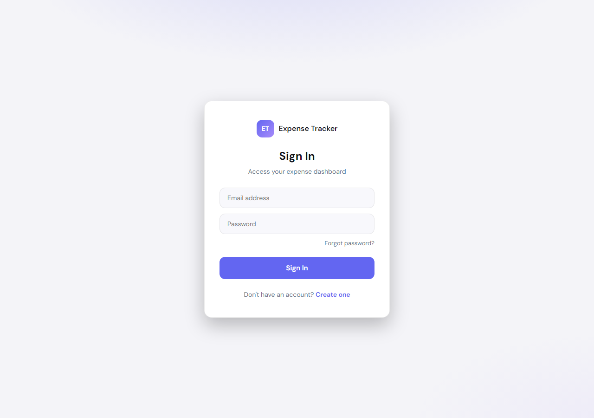
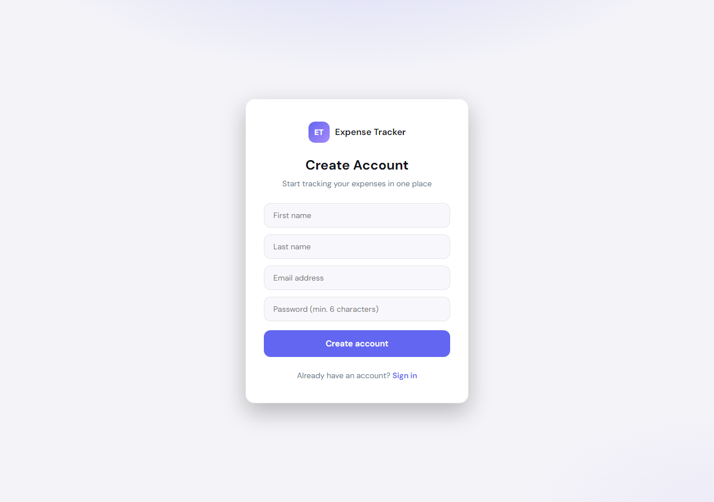
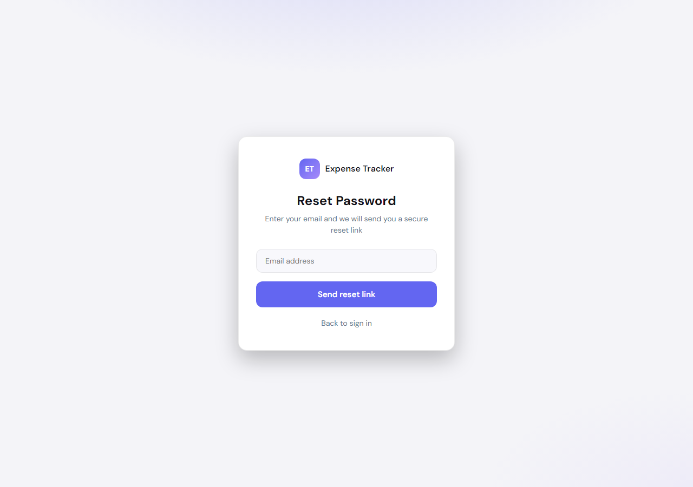
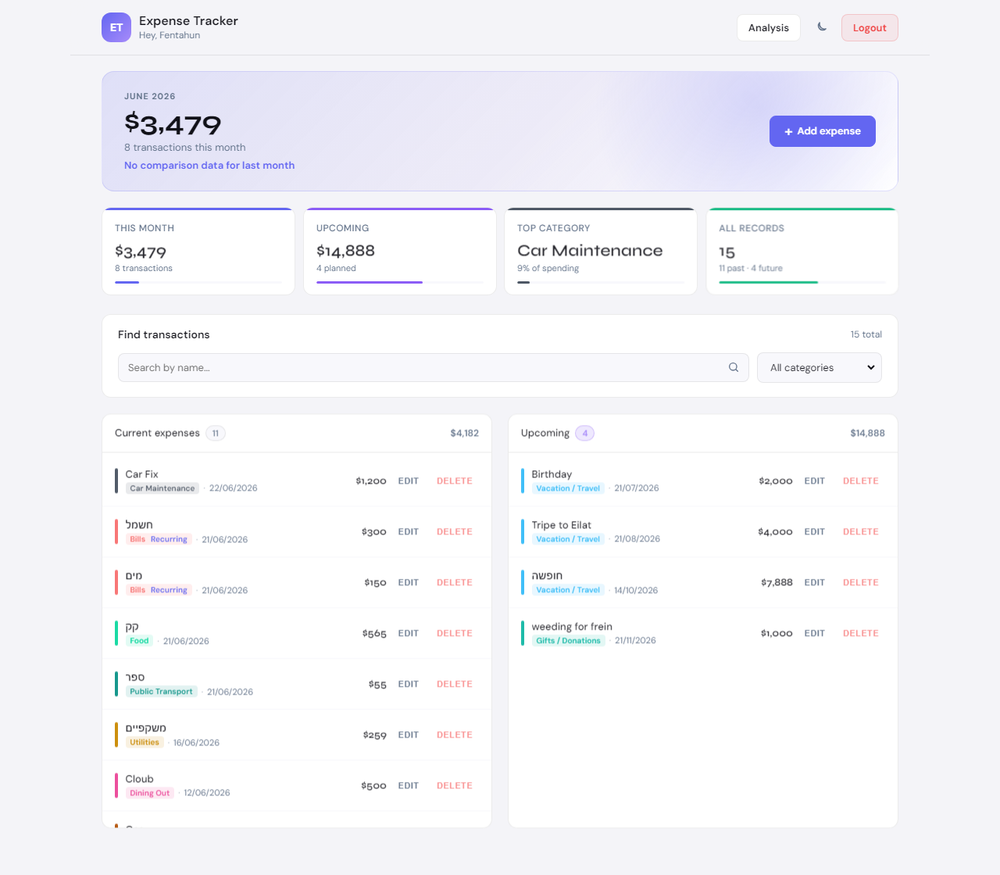
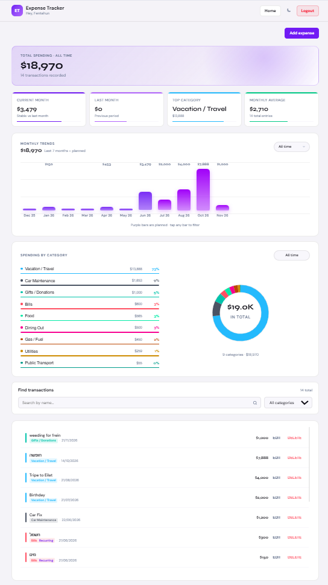

# Expense Tracker — React Frontend

Personal financial management app built as a junior developer portfolio project. Users sign in, log expenses, and review spending on a Home page and an Analysis page. Expense data is stored in Salesforce; this repository contains the React frontend and talks to a Node.js API.

This is a **personal** expense tracker — not an enterprise procurement system. Users can enter **past or future dates** so they can log what they already spent and plan upcoming payments.

---

## Project Overview

After sign-in, users can:

- View monthly spending and compare it to the previous month
- Split transactions into **current** (this month or earlier) and **upcoming** (future dates)
- Add, edit, and delete expenses
- Search and filter by category
- Open **Analysis** for charts and summary metrics
- Switch light / dark mode

Routes: **Home** (`/`) and **Analysis** (`/analysis`), with bottom navigation between them. Legacy `/dashboard` redirects to `/analysis`.

---

## Architecture & Data Flow

```
React (Vite)  →  Node.js API  →  Salesforce
      ↓
Firebase Auth + Firestore (user profile, Contact link)
```

| Layer | Role |
|-------|------|
| **Frontend** | React 19 + Vite — UI, routing, client-side charts |
| **Backend** | Node.js (Express) — verifies Firebase tokens, syncs user identity, calls Salesforce REST API |
| **Database / CRM** | Salesforce — `Contact` and custom object `Expense__c` |

The browser never connects to Salesforce directly. Each API request sends a Firebase ID token; the server resolves the user's Contact and reads or writes `Expense__c` records on their behalf.

**Registration sync:** Firebase account → Node.js creates or links a Salesforce Contact → Contact Id saved in Firestore (`users/{uid}`).

---

## Database Integrity & Validation Rules

Business rules live in **Salesforce**, not in React form logic alone. When a save fails validation, the API returns the error message and the UI shows it in a toast.

| Rule | Where enforced | What it does |
|------|----------------|--------------|
| **Expense name** | Salesforce (REGEX validation rule) | Name must contain real characters — not numbers or symbols only |
| **Amount** | Salesforce validation rule | `Amount__c` is required and must be **greater than zero** (`<= 0` is blocked) |
| **User connection** | Salesforce data model | **Master-Detail** relationship from `Expense__c` to `Contact` via `User_Contact__c` — every expense belongs to one Contact |
| **Contact email** | Salesforce validation + duplicate rules | Valid email format (REGEX), unique across Contacts, and locked from manual change after creation |

This keeps bad data out of reports and flows before it reaches the UI lists.

---

## Smart Calculations (Salesforce, Not Frontend Loops)

Weekly and monthly totals on the **Contact** — *Total Expenses This Week* and *Total Expenses This Month* — are maintained in Salesforce using **Roll-Up Summary** fields (SUM of `Amount__c` on related expenses).

Roll-ups filter through formula checkbox fields on `Expense__c`:

- `Is_This_Week__c` — marks expenses that count toward the current week
- `Is_This_Month__c` — marks expenses that count toward the current month

A record-triggered flow updates those checkboxes when expense dates change, so totals stay correct without heavy loops in Apex or in React.

The **Analysis page charts** and **Home page metrics** are calculated in the browser from the expense list returned by the API (`useMemo` over fetched records). Salesforce roll-ups support org reporting, flows, and Contact-level totals in parallel.

---

## UI & Features

### Authentication

Firebase email/password:

- **Register** — name, email, password (min. 6 characters) → Salesforce Contact + Firestore profile → redirect to login
- **Login** — Firebase sign-in; requires Firestore profile with linked Contact Id
- **Forgot password** — Firebase reset email
- **Logout** — clears session cache and signs out

Protected routes: `/` and `/analysis`. Unauthenticated users go to `/login`.

### Pages

**Home**

- Monthly hero (total, count, trend vs. last month)
- Metric cards (this month, upcoming, top category, record counts)
- Search and category filter
- Two lists: current expenses and upcoming expenses
- FAB and row actions for add, edit, delete

**Analysis**

- Period summary and metric cards
- Monthly bar chart (click a bar to filter by month)
- Category donut chart (click a segment to filter)
- Search plus month/category filters
- Transaction list with same add/edit/delete modal as Home

### Expense form

Each expense has **Name**, **Amount**, **Date**, and **Category** only. There is no Description field.

An optional **recurring** checkbox (`Is_Recurring__c`) is available for Salesforce-side recurring automation.

### General UI

- Theme stored in `localStorage`
- Toasts on save, update, delete, and validation errors
- Skeleton loader on first fetch; session cache when switching Home ↔ Analysis
- Confirm dialog before delete

---

## Technologies

| Area | Tools |
|------|--------|
| UI | React 19, CSS |
| Build | Vite |
| Routing | React Router 7 |
| HTTP | Axios |
| Auth | Firebase Auth, Firestore client SDK |
| State | React hooks, custom hooks in `hooks/` |

```
frontend/src/
├── pages/       Login, Register, ForgotPassword, Home, AnalysisView
├── components/  Layout, modals, charts, lists
├── hooks/       useAuthUser, useExpenses, useExpenseModal, useToast
├── services/    firebaseConfig, salesforceApi
└── utils/       formatting, chart helpers
```

**Setup:** Copy `frontend/.env.example` → `frontend/.env` (Firebase variables + `VITE_API_URL`, default `http://localhost:3001/api`).

```bash
cd frontend
npm install
npm run dev
```

The Node.js backend must be running for expense data to load.

---

## Application Flow

```
Register → Login → Home → add / edit / delete → Analysis → Logout
```

1. User registers; Contact and Firestore profile are created.
2. User signs in and lands on Home.
3. Expenses load from Salesforce through the API.
4. User manages transactions and filters lists on Home.
5. User opens Analysis for charts and filtered views.
6. User logs out from the top bar.

---

## Screenshots

[`docs/react-screenshots/`](docs/react-screenshots/)

### Login



### Register



### Forgot Password



### Home



### Analysis



### Add Expense

The add/edit form opens as a modal on Home and Analysis.

---

Salesforce org configuration: [`README_SALESFORCE.md`](README_SALESFORCE.md)
