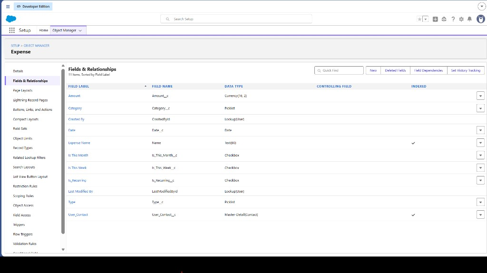
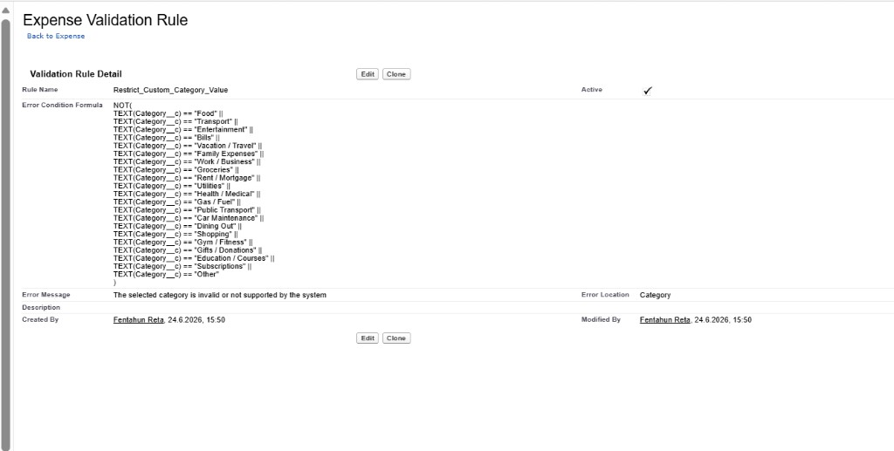
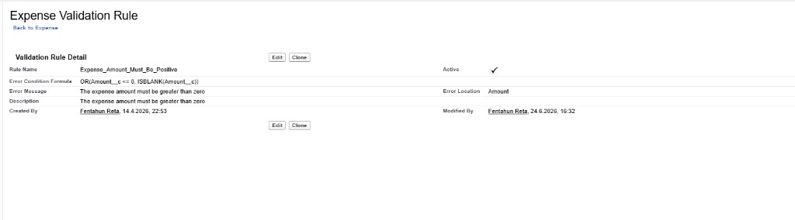
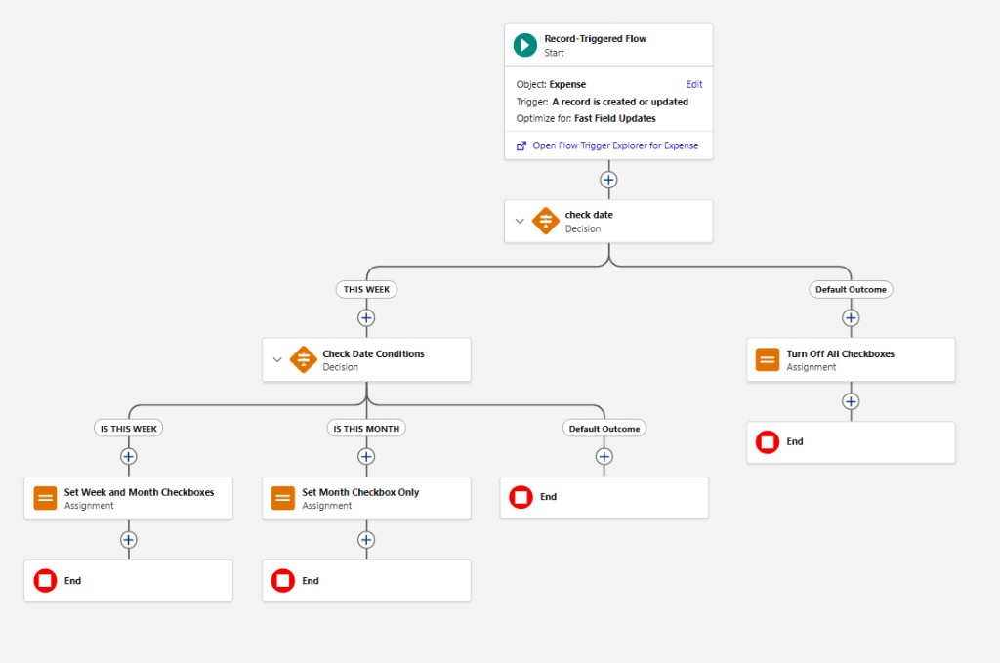
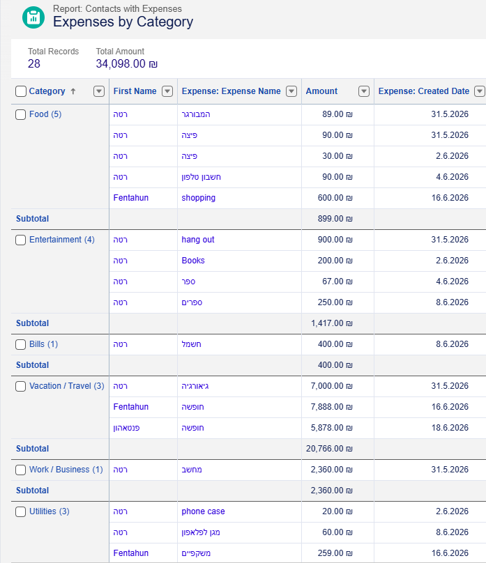
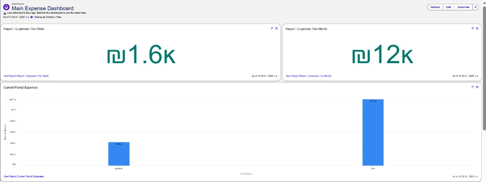
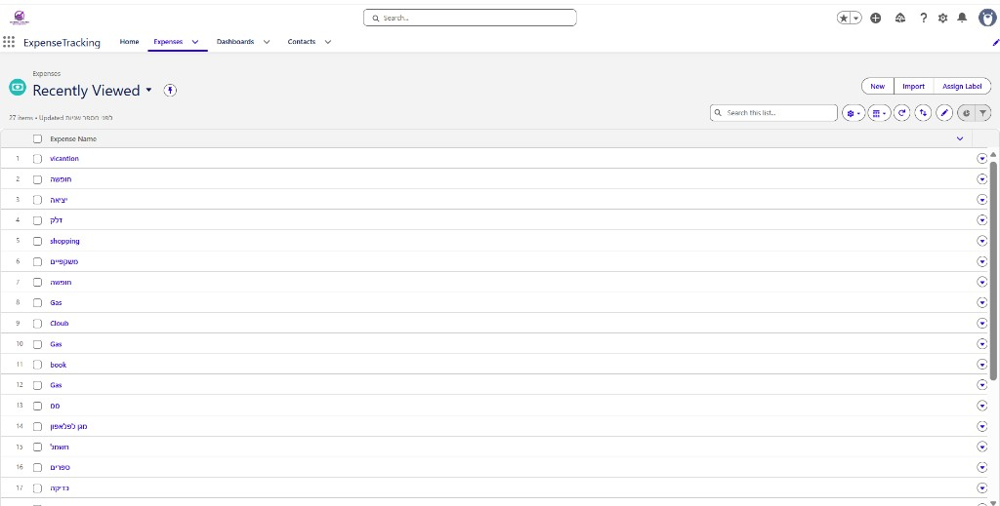

# Expense Tracker — Salesforce (Portfolio)

Junior Salesforce Admin / Developer portfolio project. Salesforce stores users and expenses; a React app reads and writes records through a Node.js API. This README documents the org configuration — screenshots are in [`docs/salesforce-screenshots/`](docs/salesforce-screenshots/). There is no SFDX source in the repo.

## Business Scenario

Personal expense tracking — not enterprise procurement. Users log past spending and plan future bills, so **dates are not restricted** to the current day.

- Each app user is a **Contact** (`LeadSource: Web App` on registration).
- Each transaction is an **Expense__c** record in a **Master-Detail** relationship to that Contact.
- **Roll-Up Summary fields** on Contact maintain weekly, monthly, and lifetime totals — no custom code or calculation flows.
- **Validation rules** and **duplicate rules** keep data clean at save time.
- **Flows** handle date checkbox maintenance, scheduled email summaries, and recurring expense generation.
- **Reports and dashboards** provide spending views inside Salesforce.

## Salesforce Features Used

| Feature | How it is used |
|---------|----------------|
| Custom object (`Expense__c`) | Stores transactions |
| Standard object (`Contact`) | Represents each app user |
| Master-Detail relationship | `User_Contact__c` — Detail Expense to Master Contact |
| Formula fields (`Is_This_Week__c`, `Is_This_Month__c`) | Filter which expenses count toward roll-up summaries |
| Roll-Up Summary fields | SUM of `Amount__c` on Contact for week / month / lifetime totals |
| Picklist (`Category__c`) | Spending categories in the app |
| Validation rules + duplicate rules | Expense and Contact field checks |
| Record-triggered flow (before save) | Sets date checkbox fields for roll-up filters |
| Scheduled flows | Weekly and monthly expense summary emails |
| Record-triggered flow | Recurring expense generation |
| Reports & dashboards | Period and category views in the org |
| Lightning app | Home page, list views, record pages |
| Connected App + REST API | External app creates and queries records |

## Custom Objects

### Expense__c

| Field | Used for |
|-------|----------|
| `Name` | Expense title |
| `Amount__c` | Amount (roll-up source field) |
| `Date__c` | Transaction date — past or future allowed |
| `Category__c` | Picklist — values loaded in the app |
| `Type__c` | On the object; not shown in the React UI |
| `Is_Recurring__c` | Recurring checkbox in the app |
| `Is_This_Week__c` | Formula checkbox — roll-up filter for current week |
| `Is_This_Month__c` | Formula checkbox — roll-up filter for current month |
| `User_Contact__c` | **Master-Detail** to Contact — set on create, enforces ownership |

Legacy picklist values `Housing` and `Transportation` are mapped to `Rent / Mortgage` and `Transport` in the API where needed.

### Contact

| Field | Used for |
|-------|----------|
| `Id` | Linked to Firebase / Firestore as `salesforceContactId` |
| `FirstName`, `LastName`, `Email` | Set on registration; email used to match existing Contact |
| `LeadSource` | `Web App` on create from registration |
| Roll-Up Summary fields | **Total Expenses This Week**, **Total Expenses This Month**, and lifetime total — SUM of `Amount__c` on related expenses, filtered by checkbox fields |

## Object Relationships

```
Contact (Master) ═══< Expense__c (Detail)
                 User_Contact__c   [Master-Detail]
```

Master-Detail enforces that every expense belongs to exactly one Contact. Deleting a Contact cascades to its expenses. The API filters by `User_Contact__c` and verifies ownership before update or delete.

## Roll-Up Summary Calculations

Contact totals are **not** calculated by Flow or Apex loops. They use native **Roll-Up Summary fields**:

| Contact field | Calculation |
|---------------|-------------|
| Total Expenses This Week | SUM of `Amount__c` where `Is_This_Week__c = TRUE` |
| Total Expenses This Month | SUM of `Amount__c` where `Is_This_Month__c = TRUE` |
| Lifetime total | SUM of `Amount__c` on all related expenses |

Before-save logic sets `Is_This_Week__c` and `Is_This_Month__c` from `Date__c` so roll-ups stay accurate when expenses are created or edited. Salesforce recalculates roll-ups automatically — no sum-on-delete flow is required.

## Validation Rules

Rules run in Salesforce on save. Errors return to the React app and display in a toast.

**Dates are not validated** — users may enter past or future dates for personal budgeting.

| Rule | What it enforces |
|------|------------------|
| **Expense name** | REGEX — cannot be numbers or symbols only |
| **Amount** | Required; must be **greater than zero** |
| **Contact name** | Cannot be numbers only |
| **Contact email** | Valid format (REGEX); **unique** (Duplicate Rules); **locked after creation** |

| Screenshot | Rule |
|------------|------|
| `03-validation-amount-positive.png` | Amount > 0 |
| `04-validation-expense-name.png` | Expense name REGEX |
| `05-validation-contact-name.png` | Contact name |
| `06-validation-contact-email.png` | Contact email (locked after creation) |
| `07-validation-contact-email-format.png` | Email format |

## Flows

The React app does not launch flows directly. It sets `Is_Recurring__c` where applicable; automation runs in the org.

### Record-triggered (before save)

| Screenshot | Flow |
|------------|------|
| `08-flow-date-checkbox-manager.png` | Sets `Is_This_Week__c` and `Is_This_Month__c` from expense date so roll-up summaries calculate correctly |

There are **no flows** that sum expenses or update totals on delete — roll-ups handle that natively.

### Scheduled

| Screenshot | Flow |
|------------|------|
| `11-flow-weekly-email-report.png` | Weekly expense summary email |
| `12-flow-monthly-email-report.png` | Monthly expense summary email |

### Recurring

| Screenshot | Flow |
|------------|------|
| `13-flow-recurring-generation.png` | Recurring expense generator |

## Reports

Built on Expense data in Salesforce. The React Analysis page uses its own client-side charts.

| Screenshot | Report |
|------------|--------|
| `14-report-expenses-this-week.png` | Expenses this week |
| `15-report-expenses-this-month.png` | Expenses this month |
| `16-report-current-period-bar-chart.png` | Current period bar chart |
| `17-report-current-period-dashboard.png` | Current period (dashboard layout) |
| `18-report-expenses-by-category.png` | By category |
| `19-report-expenses-timeline.png` | Timeline |

## Dashboards

| Screenshot | |
|------------|--|
| `20-dashboard-part-1.png` | Part 1 |
| `21-dashboard-part-2.png` | Part 2 |

## Salesforce App Structure

| Screenshot | |
|------------|--|
| `22-app-home-page-full.png` | App home |
| `23-app-home-page-part-2.png` | App home (cont.) |
| `24-expense-list-view.png` | Expense list |
| `25-contact-list-view.png` | Contact list |
| `26-expense-record-detail.png` | Expense record |

## Integration with React App

**React frontend** — Home and Analysis pages for expense CRUD and charts.

**Firebase Authentication** — Email/password sign-in; not Salesforce login.

**Node.js API** — Express server with a Connected App; credentials stay on the server.

**Salesforce as the data platform** — All expenses live in `Expense__c`; the API is the only write path from the app.

**Contact mapping** — Registration creates or matches a Contact; the Id is stored in Firestore for each Firebase user.

**Record ownership** — Queries and saves scoped to the user's Contact via `User_Contact__c`; ownership verified before update or delete.

## What I Learned

- **Salesforce Data Modeling** — Contact as parent, Expense__c as child in Master-Detail.
- **Custom Objects** — Expense fields for amount, date, category, recurring flag, and roll-up filter checkboxes.
- **Master-Detail Relationships** — Strict parent-child link through `User_Contact__c` with cascade delete.
- **Roll-Up Summary Fields** — Native SUM aggregations on Contact instead of custom total logic.
- **Formula Fields** — Checkbox filters (`Is_This_Week__c`, `Is_This_Month__c`) driving roll-up criteria.
- **Validation Rules & Duplicate Rules** — Data quality on names, amounts, and email without blocking flexible dates.
- **Record-Triggered Flows** — Before-save flow to maintain checkbox fields for roll-ups.
- **Scheduled Flows** — Automated weekly and monthly summary emails.
- **Reports and Dashboards** — Org-side reporting by period and category.
- **Connected Apps & REST API** — Secure external integration with the React app.

## Screenshots

[`docs/salesforce-screenshots/`](docs/salesforce-screenshots/)

### Expense Object



### Category Picklist



### Validation Rules



Also: [04 expense name](docs/salesforce-screenshots/04-validation-expense-name.png) · [05 contact name](docs/salesforce-screenshots/05-validation-contact-name.png) · [06 contact email](docs/salesforce-screenshots/06-validation-contact-email.png) · [07 email format](docs/salesforce-screenshots/07-validation-contact-email-format.png)

### Flow — Date Checkbox Manager (Record-Triggered)



Scheduled: [11 weekly email](docs/salesforce-screenshots/11-flow-weekly-email-report.png) · [12 monthly email](docs/salesforce-screenshots/12-flow-monthly-email-report.png)

Recurring: [13 recurring generator](docs/salesforce-screenshots/13-flow-recurring-generation.png)

### Report



Also: [14](docs/salesforce-screenshots/14-report-expenses-this-week.png) · [15](docs/salesforce-screenshots/15-report-expenses-this-month.png) · [16](docs/salesforce-screenshots/16-report-current-period-bar-chart.png) · [17](docs/salesforce-screenshots/17-report-current-period-dashboard.png) · [19](docs/salesforce-screenshots/19-report-expenses-timeline.png)

### Dashboard

 · [part 2](docs/salesforce-screenshots/21-dashboard-part-2.png)

### App UI

 · [25](docs/salesforce-screenshots/25-contact-list-view.png) · [26](docs/salesforce-screenshots/26-expense-record-detail.png) · [home 22](docs/salesforce-screenshots/22-app-home-page-full.png) · [23](docs/salesforce-screenshots/23-app-home-page-part-2.png)

Related: [`README_REACT.md`](README_REACT.md) · [`PROJECT_ANALYSIS.md`](PROJECT_ANALYSIS.md)
